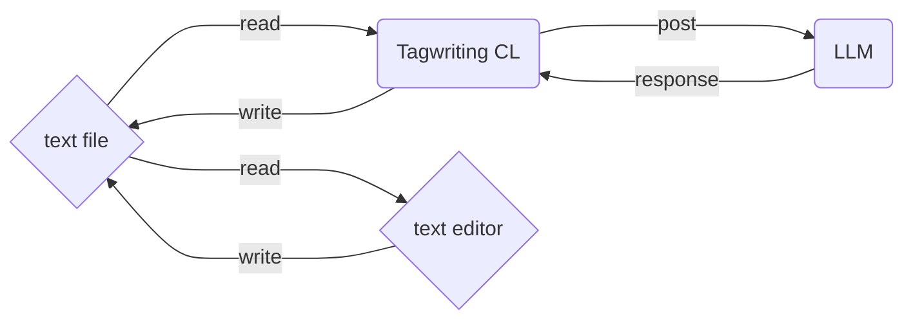

# Get Start `tagwriting`

# 0. 序

## 0.1 このドキュメントの目的

このドキュメントは、`tagwriting`をとりあえず使いたいという人のためのチュートリアルガイドです。

### 0.1.1 `tagwriting` とは何か

`tagwriting`は、簡潔に言うと、**テキストファイル全体(または一部)をコンテキストとして、LLMに渡して、その結果を受け取ってファイルを書き換えるクライアント**です。

もっと解りやすく説明すると、テキストファイルを任意のタグで囲んだ部分がプロンプトになり、あなたの好きなLLM（ChatGPTなど）の回答で置き換えるということです。

### 0.1.2 ユースケース

`tagwriting`は小規模の文章作成に向いています。

- ブログ記事の作成
- メール文章の作成
- メモアプリの補助ツール

`tagwriting`は、一つのファイルで文章が完結するような文章に、特に適しています。

また、次のような用途にも適しています。

- テキストファイルベースでの、ブレーンストーミングによるアイデア出し
- テキストファイル上で利用する簡易的なチャットアシスタント

## 0.2 環境

 `tagwriting`はPython環境で開発されているため、Pythonが使える環境ならば動く筈です。
 もし、あなたが`python`をインストールしていない場合は、`python`のオフィシャルページから`python`をインストールすることを検討してください。

 - [Pythonのインストール](https://www.python.org/downloads/)

**Note**:

  `tagwriting`はWindows向けのRelease buildを念のため用意していますが、最新版ではないため、挙動が異なる可能性があります。
  それをご理解し利用してください。推奨は`python`に付属している`pip`を使用する方法です。

  また、この`tagwriting`は、開発中ということもあり、ある程度まで技術になれている人を対象としているため、より基本的な説明は省略しています。ご了承ください。

# 1. Install

`tagwriting`は、以下のコマンドでインストールできます。

```bash
pip install tagwriting
```

 あるいは、あなたが`git`をインストールしている場合は、`git clone`するか、あるいはソース全体をダウンロードしてから、`pip install .`でインストールすることも可能です。

# 2. 最低限のセッティング

  どんなツールであれ、まずはフルカスタマイズする前にどんな使用感かを確認したいですよね？

  そのため、最低限のセッティングを説明します。

## 2.1 LLM API KEYの取得

  このツールは、外部のLLMサービスを呼び出すため、API KEYが必要です。
  
  あなたが使いたいサービスの`API KEY`を取得します。

**Note**: 典型的なプラットフォームのAPI習得ポイントは次のようになります。具体的な手順は、各プラットフォームの公式サイトを参考にしてください。

- [ChatGPT](https://platform.openai.com/account/api-keys)
- [Claude](https://console.anthropic.com/settings/keys)
- [Grok](https://console.x.ai/)
- [Gemini](https://aistudio.google.com/app/apikey)
- [DeepSeek](https://platform.deepseek.com/api_keys)

  その後、使いたいモデルとサービスのエンドポイントを確認したのちに、それらを`.env`ファイルに保存してください。

```bash
TAGWRITING_API_KEY=your_api_key
TAGWRITING_BASE_URL=https://api.openai.com/v1
TAGWRITING_MODEL=gpt-3.5-turbo
```

**Note**: 現在は、`OpenAI`の習慣に基づき、`BASE_URL`に`/chat/completions`と追加したURLにアクセスします。もし上手く動かない場合は、これを参考にしてみてください。

また、`.env`は`tagwriting`を動かす直下のディレクトリに配置するようにしてください。（例えば、`/path/to/your/project`で動かす場合は、`/path/to/your/project/.env`という形になります）

これは簡潔に次のようにも書けます。

```bash
API_KEY=your_api_key
BASE_URL=https://api.openai.com/v1
MODEL=gpt-3.5-turbo
```

  これは貴方の環境に合わせて定義してください。

　また、「API KEY等をファイルに残しておきたくない」という場合は、環境変数で設定することも可能です。

**Note:** ここでは環境変数の各OSの設定方法自体については触れません。

## 2.2 Lets write!

　さて、驚くべきことに実は`tagwriting`は、これだけでセットアップが完了です。あなたが使いたいデフェクトリでコマンドを実行するだけでOKです。

```bash
tagwriting
```

　これで、`tagwriting`は実行された現在のディレクトリを対象に、ファイル変更の監視を開始します。あとは、あなたの好みのエディタを使い、ファイルを編集していってください。
　デフォルトでの監視ファイルは`*.md`, `*.txt`, `*.markdown`です。

# 3. 基本の使い方

## 3.1 基本コンセプト

　まず直接の使い方を説明する前に、`tagwriting`の基本コンセプトを説明します。

　`tagwriting`は、テキストファイル全体(または一部)をコンテキストとして、LLMに渡して、その結果をファイルに書き換えるクライアントです。

#### 3.1.1 具体的な説明

　この抽象的な説明を、より具体的な例で説明します。（これは`tagwriting`の詳細の動作を説明するためのものなので、飛ばしてもらってもかまいません）

```markdown
# Tagwritingの素晴らしさを教えます

<prompt>tagwritingの素晴らしさを箇条書きします</prompt>
```

　このようなテキストを`tagwriting`で処理する場合、LLMに対しては次のようなプロンプトとして送られます。

```markdown
Your response will replace `@@processing@@` within the context. 
Please output text consistent with the context's integrity.

Rule:
- Do not include `@@processing@@` in your response.
- Answer the UserPrompt directly, without explanations or commentary.

Context:
# Tagwritingの素晴らしさを教えます

@@processing@@

User prompt:
Tagwritingの素晴らしさを教えます
```

解りやすく言えば、あなたが利用しているLLMサービスのWeb UIから上のプロンプトを投げ、その帰ってきたレスポンスを`@@processing@@`の部分で置き換えるということを自動的に`tagwriting`が行っているという理解で良いでしょう。

#### 3.1.2 エディタの選出

  このような説明を最初に行ったのは、`tagwriting`がエディタの挙動に依存する部分があるからです。`tagwriting`は以下のようなワークフローを想定しています。



  ここで、注意して欲しいのは、`tagwriting`がエディタと連携するためには、エディタ側が **ファイルの変更を監視し、そのファイルの変更を反映する** という動作を何らかの形で保証している必要があります。例えば、このような挙動を提供するエディタとしては、以下のものがあります。

  - [VSCode](https://code.visualstudio.com/) 
  - [Pulser(旧Atom)](https://pulsar-edit.dev/)
  - [Lite XL](https://lite-xl.com/)

　あるいは、リアルタイムではなくても、ダイアログで確認するタイプのエディタも可能です。

  - [MarkText](https://www.marktext.cc/)

　また、メモアプリのようなものも相性が良いです。

  - [Obsidian](https://obsidian.md/)
  - [Zettlr](https://www.zettlr.com/)

  これらは、ファイルの変更を監視して変更を反映する動作を提供するため、`tagwriting`と連携することができます。これをまずは押さえてください。

## 3.2 基本的なタグの使い方

それでは、`tagwriting`で使える基本的なタグの使い方を説明します。

### 3.2.1 promptタグ

`<prompt>...</prompt>`

これは、ファイル全体のコンテキストを利用し、LLMに`prompt`の内容を出力してもらうように指示するタグです。例えば、

```markdown
# Tagwritingの素晴らしさを教えます

<prompt>このツールの素晴らしさを教えてください</prompt>
```

という文章の場合、`# Tagwritingの素晴らしさを教えます`のコンテキストとともに、`<prompt>...</prompt>`の内容をLLMに渡して、そのレスポンスを待ちます。

```markdown
# Tagwritingの素晴らしさを教えます

Tagwritingはエディタ非依存のLLMクライアントツールであり、あなたの好きなエディタで利用することが可能です。
```

  `tagwriting`は曖昧なpromptの内容であっても、文章全体をコンテキストとして投げて、適切な解決をLLMに求めます。

### 3.2.2 chatタグ

しかし、あなたはもしかしたらテキスト全体をコンテキストとして使って欲しくないかもしれません。例えば、ある一定の大きくなってきた文章を、より小さな部分で区切って、それぞれをコンテキストとして投げて、適切な解決をLLMに求めたいかもしれません。そんな時、`<chat>...</chat>`タグが役立ちます。

`<chat>...</chat>`

これは、全体のコンテキストを削除し、`<chat>...</chat>`の内容のみをプロンプトとして投げます。例としては、文脈に依存しない「言葉の意味を辞書みたいに教えて欲しい」というような場合などでしょう。

```markdown
# Tagwritingの素晴らしさを教えます

<chat>「素晴らしさ」という意味を調べて</chat>
```

このように書き込むことで、次のような文章が`chat`タグで置換されます。

```markdown
# Tagwritingの素晴らしさを教えます

「素晴らしさ」とは、そのものが持つ優れている点、魅力的な点、感動を与える性質のことです。
```

### 3.2.3 promptタグとchatタグの挙動の違い

　パッと見、その違いはわからないかもしれませんが、`prompt`タグの実例を`chat`タグで使うのがわかりやすいかもしれません。

```markdown
# Tagwritingの素晴らしさを教えます

<chat>このツールの素晴らしさを教えてください</chat>
```

このとき、`chat`タグはコンテキストを削除して、`<chat>...</chat>`の内容のみをプロンプトとして投げます。`prompt`タグならば、文章全体のコンテキストを考慮してLLMが「ああ、『このツール』というのはtagwritingだな」と推測し、適切な回答を返す可能性があります。

ですが、`chat`タグはコンテキストが`chat`タグの内部に限定されるので、`chat`タグの外部にある`# Tagwritingの素晴らしさを教えます`というコンテキストを使えません。従って、以下のような文章に置換されます。

```markdown
# Tagwritingの素晴らしさを教えます

このツールとは何でしょうか？具体的に教えて頂ければ、素晴らしさを説明できます！
```

このように、`prompt`タグと`chat`タグの挙動は異なります。それぞれを賢く使い分けることが、`tagwriting`を上手に使う秘訣です。

### 3.3 属性プロンプトルール 

実際のところ、使うだけなら、`<prompt>...</prompt>`、あるいは`<chat>...</chat>`と書くだけでOKです。しかし、`tagwriting`は、もっと便利に使う方法を提供しています。その一つが**属性プロンプトルール**です。

#### 3.3.1 属性プロンプトルールのコンセプト

さて、あなたは`tagwriting`を使っていると、何度も同じようなプロンプトを指定するのにウンザリするかもしれません。例えば、あなたがアイデアをブレーンストーミングする時、何度も以下のように書くのはイヤですよね。

```markdown
<prompt>画期的なウェブサービスの案を箇条書きで出力してください。</prompt>
<prompt>面白い小説のストーリーを箇条書きで出力してください。</prompt>
<prompt>今日、私がやるべきタスクを箇条書きで出力してください。</prompt>
```

さて、このようなプロンプトを見たときに、これらのプロンプトが一つのルールを使いまわしていると気づくかもしれません。この例だと「箇条書きで出力してください」のルールが何度も繰り返されています。このとき、`tagwriting`の属性プロンプトルールを活用して、この「箇条書きで出力してください」のルールとして定義することができます。

#### 3.3.2 属性プロンプトルールの定義

一般的にこれらのルールを一つの属性プロンプトルールとして定義するには、Yamlファイルに以下のように定義することができます。

```yaml
attrs:
  simple: 
    - "シンプルな表現を使う"
    - "一行で出力"
  bullet: "箇条書きで出力してください"
```

`attrs`の内部においては、文字列あるいは、文字列のリストを定義することができます。これらの書き方については [Yamlの仕様](https://yaml.org/spec/1.2.2/semantics.html)を参照して頂くとして、二つの定義方法が可能であることだけを確認してください。

#### 3.3.3 属性プロンプトルールの使用

定義した属性プロンプトルールを適用するには、`<prompt>`タグの後ろにコロンで属性プロンプトルール名を指定するだけでOKです。

```markdown
<prompt:bullet>面白い小説のストーリーを箇条書きで出力してください。</prompt>
```

また、次のように属性プロンプトルールは「ルールの寄せ集め」と言うことができるため、コロンで複数の属性プロンプトルールを指定することができます。

```markdown
<prompt:bullet:simple>今日、私がやるべきタスクを箇条書きで出力してください。</prompt>
```

### 3.4 カスタムタグ

次に、`tagwriting`で使える**カスタムタグ**の使い方を説明します。これは、任意のタグを定義し、それを`prompt`タグならびに`chat`タグの形式に変換する機能です。一種のマクロであるとお考え下さい。

#### 3.4.1 カスタムタグのコンセプト

**属性プロンプトルール**が、それがLLMに渡すルールの定義集であると説明しました。カスタムタグは、もう少し具体的なプロンプトを定義するためのものです。例えば、あなたが次のように`prompt`を書いていたとしましょう。

```markdown
<chat>あなたの意見を聞かせて: 2035年のAIの進化</chat>
<chat>あなたの意見を聞かせて: 理想的なAIライティングツールの条件</chat>
```

これらは厳密にはルールの定義ではありません。しかし、これらは繰り返し出現しているため、もし何らかの形でこの定型文を定義することができれば、楽になりますよね。そこで登場するのが**カスタムタグ**です。

#### 3.4.2 カスタムタグの定義

カスタムタグの定義は、`tagwriting`の設定ファイルに定義します。設定ファイルは`tagwriting.yaml`です。

```yaml
tags:
  - tag: "opinion"
    change: "chat"
    content: "あなたの意見を聞かせて: {prompt}"
```

次のように定義することで、このようにタグが利用できるようになります。

```markdown
<opinion>2035年のAIの進化</opinion>
<opinion>理想的なAIライティングツールの条件</opinion>
```

これらのタグは、次のように変換されます。

```markdown
<chat>あなたの意見を聞かせて: 2035年のAIの進化</chat>
<chat>あなたの意見を聞かせて: 理想的なAIライティングツールの条件</chat>
```

**Note**: changeで指定できるタグは`prompt`と`chat`のみです。これは、他のカスタムタグが指定できるようにすると、循環参照になってシステムが壊れる可能性があるためです。

### 3.5 属性プロンプトルールとカスタムタグ

二つの繰り返しを避けるための方法を説明したのですが、これらは組み合わせて使用することが可能です。

#### 3.5.1 属性プロンプトルールとカスタムタグの組み合わせ

次のように定義することで、属性プロンプトルールとカスタムタグを組み合わせることができます。

```yaml
attrs:
  bullet: "箇条書きで出力してください"
  simple: 
   - "シンプルな表現を使う"
   - "一行で出力"

tags:
  - tag: "opinion"
    change: "chat"
    content: "あなたの意見を聞かせて: {prompt}"
```

これらは以下のように利用できます。

```markdown
<opinion:bullet>使いやすいエディタというのはどんなもの？</opinion>
```

属性プロンプトルールは、`change`で指定したタグに引き継がれます。

```markdown
<chat:bullet>あなたの意見を聞かせて: 使いやすいエディタというのはどんなもの？</chat>
```

このように、属性プロンプトルールとカスタムタグを組み合わせることで、より便利に`tagwriting`を活用することができます。

#### 3.5.2 属性プロンプトルールとカスタムタグの違い

これらを見たときに、ふと属性プロンプトルールとカスタムタグの違いが分かりにくいかもしれません。例えばあなたは`opinion`の定義を、次のように書いてもよいのではないか、と疑問に思うかもしれません。

```yaml
attrs:
  opinion: "あなたの意見を出力してください"
```

`tagwriting`にとっては、厳密な運用というのは存在しませんので、これで定義して構いません。

ですが、これだとプロンプトがルールと離れるために、若干文脈を捉えそこねる可能性があるということを指摘します。これは、プロンプトエンジニアリングの観点から注意する必要のある事項です。

これに関しては、実際の挙動を見ると解りやすいでしょう。**属性プロンプトルール**は次のように動作しています。

```markdown
Your response will replace `@@processing@@` within the context. 
Please output text consistent with the context's integrity.

Rule:
- Do not include `@@processing@@` in your response.
- Answer the UserPrompt directly, without explanations or commentary.
- あなたの意見を出力してください　 **<-ここに挿入されている**

Context:
# Tagwritingの素晴らしさを教えます

@@processing@@

User prompt:
Tagwritingの素晴らしさを教えます
```

挙動的には、カスタムタグは柔軟性が無い代わりに、`User prompt`の内部の文章として変形するため、より直接的なテキストの指示として解釈する可能性が大きくなります。`tagwriting`の作者（私）としては、次のような使い分けを推奨します。

- **属性プロンプトルール**: LLMの出力形式を定義するために使う
- **カスタムタグ**: プロンプトの文章に対する直接的な指示のために使う

# 4. もっと便利な使い方 [WIP] 

**Note**: このセクションはまだ書き途中です。暫くお待ちください……。

# 5. クックブック

この章では、`tagwriting`のYaml ファイルにおける様々な定義を紹介します。

## 5.1 プロンプトを残したい

`tagwriting`はその性質上、プロンプト自体を置き換えるために、プロンプトが残らずに消える可能性があります。そのため、テキスト上にプロンプトを残したい場合は、LLMに改めて出力してもらうのが良いでしょう。次のような属性プロンプトルールを定義することで、LLMにプロンプトを残してもらうように指示できます。

```yaml
attrs:
  remain: 
    - "user promptを`> `付きで残す。"
    - "ただし、contextは削除する。"
```

これにより、テキストファイルを簡易的なチャットクライアントとして利用することが可能になります。

```markdown
> こんにちは！

こんにちは！なにか聞きたいことがある？

<prompt:remain>今後、LLMはどのように発展していくと思う？</prompt>
```