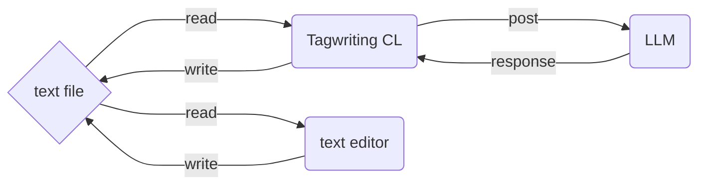

# Get Start `tagwriting`

# 0. 序

## 0.1 このドキュメントの目的

このドキュメントは、`tagwriting`をとりあえず使いたいという人のためのチュートリアルガイドです。

### 0.1.1 `tagwriting` とは何か

`tagwriting`は、簡潔に言うと、**テキストファイル全体(または一部)をコンテキストとして、LLMに渡して、その結果を受け取ってファイルを書き換えるクライアント（CUI）**です。

もっと解りやすく説明すると「テキストファイルを任意のタグで囲んだ部分がプロンプトになり、あなたの好きなLLM（ChatGPTなど）の回答で置き換えるクライアント」だとお考え下さい。

### 0.1.2 ユースケース

`tagwriting`は小規模の文章作成に向いています。

- ブログ記事の作成
- メール文章の作成
- メモアプリの補助ツール

`tagwriting`は、一つのファイルで文章が完結するような文章に、特に適しています。

また、次のような用途にも適しています。

- テキストファイルベースでの、ブレーンストーミングによるアイデア出し
- テキストファイル上で利用する簡易的なチャットアシスタント

## 0.2 環境

 `tagwriting`はPython環境で開発されているため、Python（3.8以上）が使える環境ならば動く筈です。
 もし、あなたが`python`をインストールしていない場合は、`python`のオフィシャルページから`python`をインストールすることを検討してください。

 - [Pythonのインストール](https://www.python.org/downloads/)

**Note**:

  `tagwriting`はWindows向けのRelease buildを念のため用意していますが、最新版ではないため、挙動が異なる可能性があります。
  それをご理解し利用してください。推奨は`python`に付属している`pip`を使用する方法です。

  また、この`tagwriting`は、開発中ということもあり、ある程度まで技術になれている人を対象としているため、より基本的な説明は省略しています。ご了承ください。

# 1. Install

`tagwriting`は、以下のコマンドでインストールできます。

```bash
pip install tagwriting
```

 あるいは、あなたが`git`をインストールしている場合は、`git clone`するか、あるいはソース全体をダウンロードしてから、`pip install .`でインストールすることも可能です。

# 2. 最低限のセッティング

  どんなツールであれ、まずはフルカスタマイズする前にどんな使用感かを確認したいですよね？

  そのため、最低限のセッティングを説明します。

## 2.1 LLM API KEYの取得

  このツールは、外部のLLMサービスを呼び出すため、API KEYが必要です。
  
  あなたが使いたいサービスの`API KEY`を取得します。

**Note**: 典型的なプラットフォームのAPI習得ポイントは次のようになります。具体的な手順は、各プラットフォームの公式サイトを参考にしてください。

- [ChatGPT](https://platform.openai.com/account/api-keys)
- [Claude](https://console.anthropic.com/settings/keys)
- [Grok](https://console.x.ai/)
- [Gemini](https://aistudio.google.com/app/apikey)
- [DeepSeek](https://platform.deepseek.com/api_keys)

  その後、使いたいモデルとサービスのエンドポイントを確認したのちに、それらを、`tagwriting`が実行されるディレクトリに、`.env`ファイルとして保存してください。`.env`の内容は次のようになります。

```bash
TAGWRITING_API_KEY=your_api_key
TAGWRITING_BASE_URL=https://api.openai.com/v1
TAGWRITING_MODEL=gpt-3.5-turbo
```

**Note**: 現在は、`OpenAI`の習慣に基づき、`BASE_URL`に`/chat/completions`と追加したURLにアクセスします。もし上手く動かない場合は、これを参考にしてみてください。

また、`.env`は`tagwriting`を動かす直下のディレクトリに配置するようにしてください。（例えば、`/path/to/your/project`で動かす場合は、`/path/to/your/project/.env`という形になります）

これは簡潔に次のようにも書けます。

```bash
API_KEY=your_api_key
BASE_URL=https://api.openai.com/v1
MODEL=gpt-3.5-turbo
```

  これは貴方の環境に合わせて定義してください。

　また、「API KEY等をファイルに残しておきたくない」という場合は、環境変数で設定することも可能です。

**Note:** ここでは環境変数の各OSの設定方法自体については触れません。

## 2.2 Lets write!

　さて、驚くべきことに実は`tagwriting`は、これだけでセットアップが完了です。あなたが使いたいデフェクトリでコマンドを実行するだけでOKです。

```bash
tagwriting
```

　これで、`tagwriting`は実行された現在のディレクトリを対象に、ファイル変更の監視を開始します。あとは、あなたの好みのエディタを使い、ファイルを編集していってください。
　デフォルトでの監視ファイルは`*.md`, `*.txt`, `*.markdown`です。

# 3. 基本の使い方

## 3.1 基本コンセプト

　まず直接の使い方を説明する前に、`tagwriting`の基本コンセプトを説明します。

　`tagwriting`は、テキストファイル全体(または一部)をコンテキストとして、LLMに渡して、その結果をファイルに書き換えるクライアントです。

#### 3.1.1 具体的な説明

　この抽象的な説明を、より具体的な例で説明します。（これは`tagwriting`の詳細の動作を説明するためのものなので、飛ばしてもらってもかまいません）

```markdown
# Tagwritingの素晴らしさを教えます

<prompt>tagwritingの素晴らしさを箇条書きします</prompt>
```

　このようなテキストを`tagwriting`で処理する場合、LLMに対しては次のようなプロンプトとして送られます。

```markdown
Your response will replace `@@processing@@` within the context. 
Please output text consistent with the context's integrity.

Rule:
- Do not include `@@processing@@` in your response.
- Answer the UserPrompt directly, without explanations or commentary.

Context:
# Tagwritingの素晴らしさを教えます

@@processing@@

User prompt:
Tagwritingの素晴らしさを教えます
```

解りやすく言えば、あなたが利用しているLLMサービスのWeb UIから上のプロンプトを投げ、その帰ってきたレスポンスを`@@processing@@`の部分で置き換えるということを自動的に`tagwriting`が行っているという理解で良いでしょう。

#### 3.1.2 エディタの選出

  このような説明を最初に行ったのは、`tagwriting`がエディタの挙動に依存する部分があるからです。`tagwriting`は以下のようなワークフローを想定しています。



  ここで、注意して欲しいのは、`tagwriting`がエディタと連携するためには、エディタ側が **ファイルの変更を監視し、そのファイルの変更を反映する** という動作を何らかの形で保証している必要があります。例えば、このような挙動を提供するエディタとしては、以下のものがあります。

  - [VSCode](https://code.visualstudio.com/) 
  - [Pulser(旧Atom)](https://pulsar-edit.dev/)
  - [Lite XL](https://lite-xl.com/)

　あるいは、リアルタイムではなくても、ダイアログで確認するタイプのエディタも可能です。

  - [MarkText](https://www.marktext.cc/)

　また、メモアプリのようなものも相性が良いです。

  - [Obsidian](https://obsidian.md/)
  - [Zettlr](https://www.zettlr.com/)

  これらは、ファイルの変更を監視して変更を反映する動作を提供するため、`tagwriting`と連携することができます。これをまずは押さえてください。

## 3.2 基本的なタグの使い方

それでは、`tagwriting`で使える基本的なタグの使い方を説明します。

### 3.2.1 promptタグ

`<prompt>...</prompt>`

これは、ファイル全体のコンテキストを利用し、LLMに`prompt`の内容を出力してもらうように指示するタグです。例えば、

```markdown
# Tagwritingの素晴らしさを教えます

<prompt>このツールの素晴らしさを教えてください</prompt>
```

という文章の場合、`# Tagwritingの素晴らしさを教えます`のコンテキストとともに、`<prompt>...</prompt>`の内容をLLMに渡して、そのレスポンスを待ちます。

```markdown
# Tagwritingの素晴らしさを教えます

Tagwritingはエディタ非依存のLLMクライアントツールであり、あなたの好きなエディタで利用することが可能です。
```

  `tagwriting`は曖昧なpromptの内容であっても、文章全体をコンテキストとして投げて、適切な解決をLLMに求めます。

### 3.2.2 chatタグ

しかし、あなたはもしかしたらテキスト全体をコンテキストとして使って欲しくないかもしれません。例えば、ある一定の大きくなってきた文章を、より小さな部分で区切って、それぞれをコンテキストとして投げて、適切な解決をLLMに求めたいかもしれません。そんな時、`<chat>...</chat>`タグが役立ちます。

`<chat>...</chat>`

これは、全体のコンテキストを削除し、`<chat>...</chat>`の内容のみをプロンプトとして投げます。例としては、文脈に依存しない「言葉の意味を辞書みたいに教えて欲しい」というような場合などでしょう。

```markdown
# Tagwritingの素晴らしさを教えます

<chat>「素晴らしさ」という意味を調べて</chat>
```

このように書き込むことで、次のような文章が`chat`タグで置換されます。

```markdown
# Tagwritingの素晴らしさを教えます

「素晴らしさ」とは、そのものが持つ優れている点、魅力的な点、感動を与える性質のことです。
```

### 3.2.3 promptタグとchatタグの挙動の違い

　パッと見、その違いはわからないかもしれませんが、`prompt`タグの実例を`chat`タグで使うのがわかりやすいかもしれません。

```markdown
# Tagwritingの素晴らしさを教えます

<chat>このツールの素晴らしさを教えてください</chat>
```

このとき、`chat`タグはコンテキストを削除して、`<chat>...</chat>`の内容のみをプロンプトとして投げます。`prompt`タグならば、文章全体のコンテキストを考慮してLLMが「ああ、『このツール』というのはtagwritingだな」と推測し、適切な回答を返す可能性があります。

ですが、`chat`タグはコンテキストが`chat`タグの内部に限定されるので、`chat`タグの外部にある`# Tagwritingの素晴らしさを教えます`というコンテキストを使えません。従って、以下のような文章に置換されます。

```markdown
# Tagwritingの素晴らしさを教えます

このツールとは何でしょうか？具体的に教えて頂ければ、素晴らしさを説明できます！
```

このように、`prompt`タグと`chat`タグの挙動は異なります。それぞれを賢く使い分けることが、`tagwriting`を上手に使う秘訣です。

### 3.3 属性プロンプトルール 

実際のところ、使うだけなら、`<prompt>...</prompt>`、あるいは`<chat>...</chat>`と書くだけでOKです。しかし、`tagwriting`は、もっと便利に使う方法を提供しています。その一つが**属性プロンプトルール**です。

#### 3.3.1 属性プロンプトルールのコンセプト

さて、あなたは`tagwriting`を使っていると、何度も同じようなプロンプトを指定するのにウンザリするかもしれません。例えば、あなたがアイデアをブレーンストーミングする時、何度も以下のように書くのはイヤですよね。

```markdown
<prompt>画期的なウェブサービスの案を箇条書きで出力してください。</prompt>
<prompt>面白い小説のストーリーを箇条書きで出力してください。</prompt>
<prompt>今日、私がやるべきタスクを箇条書きで出力してください。</prompt>
```

さて、このようなプロンプトを見たときに、これらのプロンプトが一つのルールを使いまわしていると気づくかもしれません。この例だと「箇条書きで出力してください」のルールが何度も繰り返されています。このとき、`tagwriting`の属性プロンプトルールを活用して、この「箇条書きで出力してください」のルールとして定義することができます。

#### 3.3.2 属性プロンプトルールの定義

一般的にこれらのルールを一つの属性プロンプトルールとして定義するには、Yamlファイルに以下のように定義することができます。

```yaml
attrs:
  simple: 
    - "シンプルな表現を使う"
    - "一行で出力"
  bullet: "箇条書きで出力してください"
```

そして、このように属性プロンプトルールを定義したYamlファイルを次のように指定できます

```bash
tagwriting --templates sample.yaml
```

`attrs`の内部においては、文字列あるいは、文字列のリストを定義することができます。Yaml自体の書き方については [Yamlの仕様](https://yaml.org/spec/1.2.2/semantics.html)を参照して頂くとして、二つの定義方法が可能であることだけを確認してください。

#### 3.3.3 属性プロンプトルールの使用

定義した属性プロンプトルールを適用するには、`<prompt>`タグの後ろにコロンで属性プロンプトルール名を指定するだけでOKです。

```markdown
<prompt:bullet>面白い小説のストーリーを考えて</prompt>
```

また、次のように属性プロンプトルールは「ルールの寄せ集め」と言うことができるため、コロンで複数の属性プロンプトルールを指定することができます。

```markdown
<prompt:bullet:simple>今日、私がやるべきタスクはなんですか？</prompt>
```

### 3.4 カスタムタグ

次に、`tagwriting`で使える**カスタムタグ**の使い方を説明します。これは、任意のタグを定義し、それを`prompt`タグならびに`chat`タグの形式に変換する機能です。一種のマクロであるとお考え下さい。

#### 3.4.1 カスタムタグのコンセプト

**属性プロンプトルール**が、それがLLMに渡すルールの定義集であると説明しました。カスタムタグは、もう少し具体的なプロンプトを定義するためのものです。例えば、あなたが次のように`prompt`を書いていたとしましょう。

```markdown
<chat>あなたの意見を聞かせて: 2035年のAIの進化</chat>
<chat>あなたの意見を聞かせて: 理想的なAIライティングツールの条件</chat>
```

これらは厳密にはルールの定義ではありません。しかし、これらは繰り返し出現しているため、もし何らかの形でこの定型文を定義することができれば、楽になりますよね。そこで登場するのが**カスタムタグ**です。

#### 3.4.2 カスタムタグの定義

カスタムタグの定義は、`tagwriting`の設定ファイルに定義します。設定ファイルは`tagwriting.yaml`です。

```yaml
tags:
  - tag: "opinion"
    change: "chat"
    content: "あなたの意見を聞かせて: {prompt}"
```

次のように定義することで、このようにタグが利用できるようになります。

```markdown
<opinion>2035年のAIの進化</opinion>
<opinion>理想的なAIライティングツールの条件</opinion>
```

これらのタグは、次のように変換されます。

```markdown
<chat>あなたの意見を聞かせて: 2035年のAIの進化</chat>
<chat>あなたの意見を聞かせて: 理想的なAIライティングツールの条件</chat>
```

**Note**: changeで指定できるタグは`prompt`と`chat`のみです。これは、他のカスタムタグが指定できるようにすると、循環参照になってシステムが壊れる可能性があるためです。

### 3.5 属性プロンプトルールとカスタムタグ

二つの繰り返しを避けるための方法を説明したのですが、これらは組み合わせて使用することが可能です。

#### 3.5.1 属性プロンプトルールとカスタムタグの組み合わせ

次のように定義することで、属性プロンプトルールとカスタムタグを組み合わせることができます。

```yaml
attrs:
  bullet: "箇条書きで出力してください"
  simple: 
   - "シンプルな表現を使う"
   - "一行で出力"

tags:
  - tag: "opinion"
    change: "chat"
    content: "あなたの意見を聞かせて: {prompt}"
```

これらは以下のように利用できます。

```markdown
<opinion:bullet>使いやすいエディタというのはどんなもの？</opinion>
```

属性プロンプトルールは、`change`で指定したタグに引き継がれます。

```markdown
<chat:bullet>あなたの意見を聞かせて: 使いやすいエディタというのはどんなもの？</chat>
```

このように、属性プロンプトルールとカスタムタグを組み合わせることで、より便利に`tagwriting`を活用することができます。

#### 3.5.2 属性プロンプトルールとカスタムタグの違い

これらを見たときに、ふと属性プロンプトルールとカスタムタグの違いが分かりにくいかもしれません。例えばあなたは`opinion`の定義を、次のように書いてもよいのではないか、と疑問に思うかもしれません。

```yaml
attrs:
  opinion: "あなたの意見を出力してください"
```

`tagwriting`にとっては、厳密な運用というのは存在しませんので、これで定義して構いません。

ですが、これだとプロンプトがルールと離れるために、若干文脈を捉えそこねる可能性があるということを指摘します。これは、プロンプトエンジニアリングの観点から注意する必要のある事項です。

これに関しては、実際の挙動を見ると解りやすいでしょう。**属性プロンプトルール**は次のように動作しています。

```markdown
Your response will replace `@@processing@@` within the context. 
Please output text consistent with the context's integrity.

Rule:
- Do not include `@@processing@@` in your response.
- Answer the UserPrompt directly, without explanations or commentary.
- あなたの意見を出力してください　 **<-ここに挿入されている**

Context:
# Tagwritingの素晴らしさを教えます

@@processing@@

User prompt:
Tagwritingの素晴らしさを教えます
```

挙動的には、カスタムタグは柔軟性が無い代わりに、`User prompt`の内部の文章として変形するため、より直接的なテキストの指示として解釈する可能性が大きくなります。`tagwriting`の作者（私）としては、次のような使い分けを推奨します。

- **属性プロンプトルール**: LLMの出力形式を定義するために使う
- **カスタムタグ**: プロンプトの文章に対する直接的な指示のために使う

# 4. 便利な使い方

私たちは、`tagwriting`の基本的な使い方を取得しました（やりましたね！）。しかし、もっと便利な使い方を`tagwriting`は提供しています。そういったビルドインのタグ達を紹介します。

## 4.1 ビルドインのタグ

### 4.1.1 includeタグ

`include`タグは、そのファイルから見た、指定されたファイルが恰もそこに書き込まれているかのように扱うタグです。

具体的には、`foo.md`というのが以下のように存在していると仮定しましょう。

```markdown
これはfoo.mdに書き込まれたテストデータです。
```

このファイルの存在を前提として、`bar.md`を次のように書きましょう。

```markdown
# 本文
<include>foo.md</include>
```

次のように保存すると、`tagwriting`は、自身の内部で次のように`bar.md`を構成します。

```markdown
# 本文
これはfoo.mdに書き込まれたテストデータです。
```

また、この`include`タグは、`chat`タグ内部でも使えます。

```markdown
<chat>
  <include>foo.md</include>
  上のデータはどんな性質のデータですか？
</chat>
```

これにより、簡単なファイルの分割管理を便利にできます。

**Note**: 自身の内部で、ということは、直接的に`include`のファイルは書き込まれるわけではないということに注意してください。`include`は、`include`のタグのまま残ります。この仕様は、`include`の参照先が更新の多いファイルであることを考慮して、別々に管理できるように作られています。

**Note**: `include`内部のタグはそれ以上展開されません。これは循環ファイルの解決をまだロジックとして入れてないためです。

**Note**: `include`内部の`prompt`や`chat`なども展開されません。

### 4.1.2 wikipediaタグ

LLMは、確かに賢いとはいえ、限界があります。LLMには「カットオフ」があります。「カットオフ」はLLMモデルのある日時までの学習データであり、LLMはそれ以降の情報にはアクセスできません。また、LLMも全ての知識を持っているわけではなく、曖昧な知識も存在するでしょう。従って、もし詳細な情報を参照したい場合は、外部の情報で補完する必要があります。

その方法の一つに、`wikipedia`タグを使うという方法があります。

```markdown
<chat>
  <wikipedia>OpenAI</wikipedia>の役員について教えて
</chat>
```

次のように書くと、`tagwriting`は、wikipediaのAPIを参照し、記事の内容を確認したのちに、LLMに渡す全体的なプロンプトの、ソースセクションに記事の内容を追加します。このことにより、より正確な回答を得ることができます。

### 4.1.3 URLタグ

とはいえ、Wikipediaの記事を参照するだけでなく、外部のURLを参照することもできます。これは`URL`タグで行います。

```markdown
<chat>
  <URL>https://example.com</URL>
  上の内容を日本語訳して
</chat>
```

これも`include`タグのように振舞います。また、URLタグの内部のHTMLは除去され、純粋なテキストデータのみを出力します。

**Note**: ただし、URLタグが除去されたあとの空白文字は、デフォルトの挙動では、そのまま残されます。これは、この空白文字がそのHTML構造を間接的に反映していると仮定し、LLM側がこのことを考慮してくれるからです。

**Note**: URLタグが除去されるとはいえ、テキストとして付随している余計な情報は残っているので、多少トークン料金がかかる可能性があります。それを考慮に入れてください。

## 4.2 Yaml Templates Guide

私たちは、Yamlファイル内において、`tagwriting`で使える属性プロンプトルールや、カスタムタグを定義することができると説明しました。しかし、実はYamlファイルは、このほかにも様々な定義を行うことが可能です。`tagwriting`では、これらを総称して**Yaml Templates**と呼びます。

**Yaml Templates**は、`tagwriting`で使える様々な定義を集積したものです。これは歴史的な理由から`Templates`と呼んでいますが、実際はConfigファイルとしても利用されています。

**Note**: 歴史的な理由とは、これらがあくまで「属性プロンプトルール」や「カスタムタグ」を定義する場所として指定されていたものですが、作者の怠惰により、このファイルに全部集積するようになったという経緯があります。

### 4.2.1 `ignore`と`target`フィールド

`tagwriting`のデフォルト監視ファイルは`*.md`, `*.markdown`, `*.txt`なのですが、世の中にはテキストファイルとして取り扱われるはずの拡張子というのはいくらでもあります。そうすると、このような挙動を変更したいと思うことがあると思われます。また、あなたには`tagwriting`に監視して欲しくないファイルというのも存在しているかもしれません。

そこで、`ignore`と`target`の登場です。これらのフィールドは、`tagwriting`が処理するべきファイルを指定するためのフィールドです。

```yaml
target:
  - "*.rst"
  - "*.org"
  - "*.md"

ignore:
  - "himitsu/*"
  - "sugoi_himitu_mityadame_dayo.md"
```

このように`target`で監視して欲しいファイルを指定し、`ignore`で監視して欲しくないファイルを指定することで、`tagwriting`の監視ファイルを制御することができます。

**Note**: `target`と`ignore`は、デフォルトの`*.md`, `*.markdown`, `*.txt`を上書きするものとなります。従って、`target`を指定した場合に、これらのファイルも監視したい場合は、`target`に追加してください。

### 4.2.2 `history`フィールド

あなたは、`tagwriting`を普通に使っていると、編集したファイルのあとに「edit_file.history.md」というファイルが作られていることに気が付くでしょう。これは`history`ファイルと呼び、いわゆる`tagwriting`がやり取りした履歴を簡潔に記録したログファイルです。これは、`tagwriting`がテキストファイルを上書きする挙動をするために、何らかの形でバックアップの手掛かりが得られるようにと要請されている機能です。

**Note**: 厳密な意味でのバックアップではないことに注意してください。あくまでもこれらは「コンテキストを除去して行われたやり取りのログ」であり、そのファイル全体＝コンテキストは保存されていません。これは肥大化を防ぐためです。

しかし、あなたはもしかしたら`edit_file.history.md`というのをいちいち作るのではなく、`history.md`に集積して欲しいかもしれません。あるいは、`edit_file.history.log`という名前のほうが好みかも知れません。このような要望に応えるために、このフィールドがあります。

```yaml
history:
  file: "./{filename}.history.log"
  template: |
    ---
    **Prompt**: 
    {prompt}
    **Result**: 
    {result}
    **Timestamp**: 
    {timestamp}
```

このように、`history`フィールドを定義することで、`tagwriting`の記録ファイルと、その記録のためのテンプレートを定義することができます。

### 4.2.3 `prompt`フィールド

あなたが私よりも遥かに優秀なプロンプトエンジニアならば、もっと素晴らしい定義をできると考えるかもしれません。そんな貴方の為に、`prompt`フィールドで、いわゆるメタテンプレートを定義することが出来ます。

```yaml
prompt: |
  あなたの回答はcontext内の`@@processing@@`と置換されます。
  前後の文章（テキスト）との整合性を合わせ、テキストを出力してください。
  
  Rule:
   - `@@processing@@`は貴方の解答に含めないでください。
   - 解説や説明、返事を含めず、user promptに直接回答してください。
  {attrs_rules}
  
  Wikipedia Resources:
  {wikipedia_resources}
  
  ---
  Context:
  {context}
  ---  
  user prompt:
  {prompt}
```

# 5. 少し高度な使い方

さて、このセクションは以前よりもちょっと高度な設定を説明します。

## 5.1 LLMの切り替え

例えば、あなたは自身の目的に即してLLMを切り替える必要があるかもしれません。文章を書く？なら`clude 3 sonnet`がいい？それとも寛容な`grok`？あるいは、`gemini`？

もし、あなたが複数のAPIを所持していたり、あるいは用途の違いによって、異なるモデルを使い分けたいという場合、`.env.{llm_name}`ファイルを用意して、それぞれのLLMの設定を定義することができます。これらは、`<chat({llm_name})>`といった形式で呼び出すことが可能です。具体的には:

```markdown
<chat(gpt)>これはChatGPTの.envファイルを参照する例です</chat>
```

と書くと、`.env.gpt`ファイルを参照して、ChatGPTの設定を読み込みます。

## 5.2 Yaml Templatesにおける高度な設定

Yaml Templatesには、より`tagwriting`を制御するための高度な設定を行うことも可能です。現在、以下のようなフィールドが存在しています。デフォルトでは、次のように設定されています。

```yaml
config:
  # duplicate prompt check
  # -> 以前と同じプロンプトが入ってきたら実行しない
  # -> これは、auto saveに対応しているエディタでUndoすると同じプロンプトが何度も発行されるため
  duplicate_prompt: false
  # simple merge
  # -> 2回目以降のファイルに`@@processing@@`があった場合、前回の結果を挟み込む
  simple_merge: true
  # hot reload yaml
  # -> 自身の設定ファイルの変更を検知し、変更があった場合はhot reloadする
  hot_reload_yaml: false
  # verbose print
  # -> 詳細な出力をする
  verbose_print: false
```

# 6. クックブック

この章では、`tagwriting`の**Yaml Template**における便利な定義や設定を紹介します。

## 6.1 プロンプトを残したい

`tagwriting`はその性質上、プロンプト自体を置き換えるために、プロンプトが残らずに消える可能性があります。そのため、テキスト上にプロンプトを残したい場合は、LLMに改めて出力してもらうのが良いでしょう。次のような属性プロンプトルールを定義することで、LLMにプロンプトを残してもらうように指示できます。

```yaml
attrs:
  remain: 
    - "user promptを`> `付きで残す。"
    - "ただし、contextは削除する。"
```

これにより、テキストファイルを簡易的なチャットクライアントとして利用することが可能になります。

```markdown
> こんにちは！

こんにちは！なにか聞きたいことがある？

<prompt:remain>今後、LLMはどのように発展していくと思う？</prompt>
```

## 6.2 Redditのスレッドを翻訳したい

Redditのスレッド全体はJavaScriptで動的に要素が挟み込まれるため、全てを翻訳することはできませんが、しかしスレッドの最初の文章を翻訳することは可能です。次のような属性プロンプトルールを定義することで、スレッドの最初の文章を翻訳することができます。

```yaml
attrs:
  japanese: 
    - "文章を日本語で出力する。"
    - "英文が出てきた場合は、日本語として自然な形にしてから出力する。"

tags:
  - tag: "rewrite"
    format: "```{prompt}``` 上の文章を書き換えてください。"
    change: "chat"
```

このように定義することで、下のように書くことが可能になります。

```markdown
<rewrite:japanese>
  <include>https://www.reddit.com/r/tagwriting/123456789</include>
</rewrite>
```
